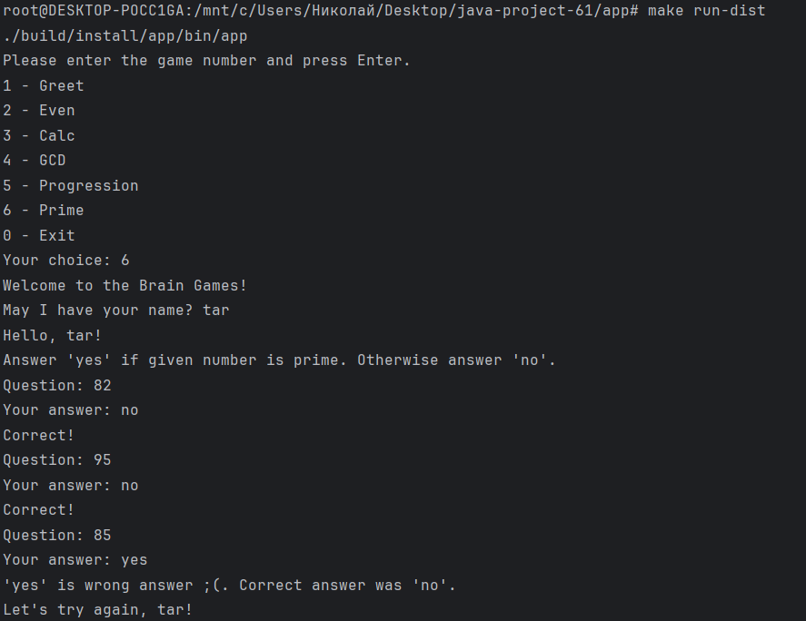

### Hexlet tests and linter status:
[](https://github.com/TaRgITay008/java-project-61/actions)
[](http://localhost:9000/dashboard?id=java-project-61)

## Описание

Консольный набор из 5 математических игр для тренировки ума. Каждая игра задаёт 3 вопроса. Для победы нужно дать 3 правильных ответа подряд. Одна ошибка — игра завершается.

## Игры

| Номер | Игра | Описание |
|-------|------|----------|
| 2 | Even | Определить, чётное ли число |
| 3 | Calc | Вычислить результат выражения (+, -, *) |
| 4 | GCD | Найти наибольший общий делитель двух чисел |
| 5 | Progression | Найти пропущенное число в арифметической прогрессии |
| 6 | Prime | Определить, является ли число простым |

## Установка и запуск

```bash
make build
make run-dist


## 🎮 Примеры запуска игр

### Игра "НОД" - Победа


### Игра "Простое число" - Поражение


