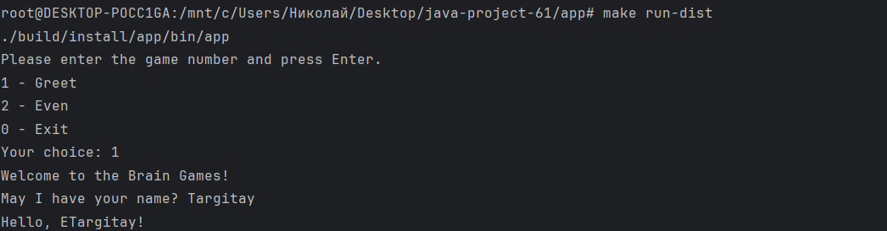
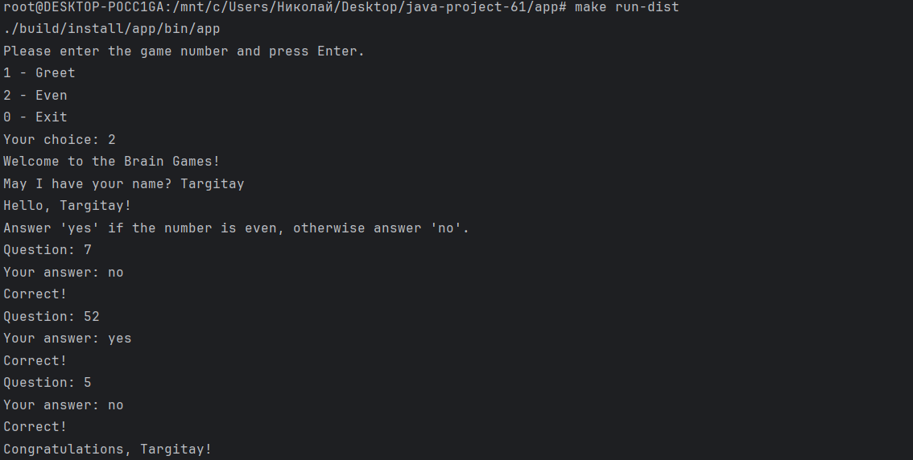
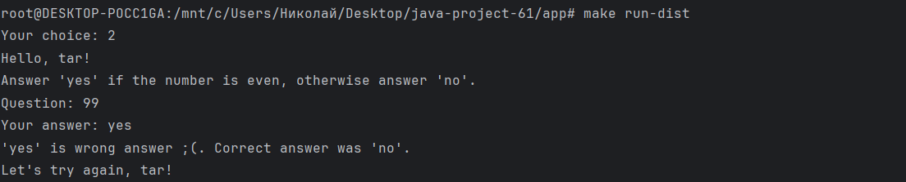
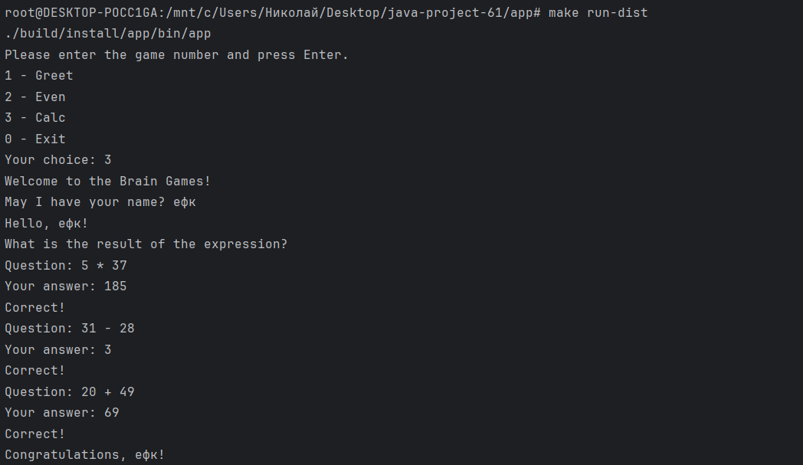
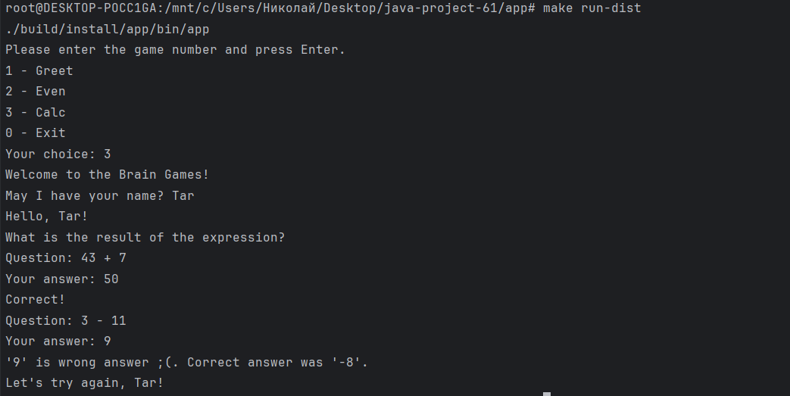
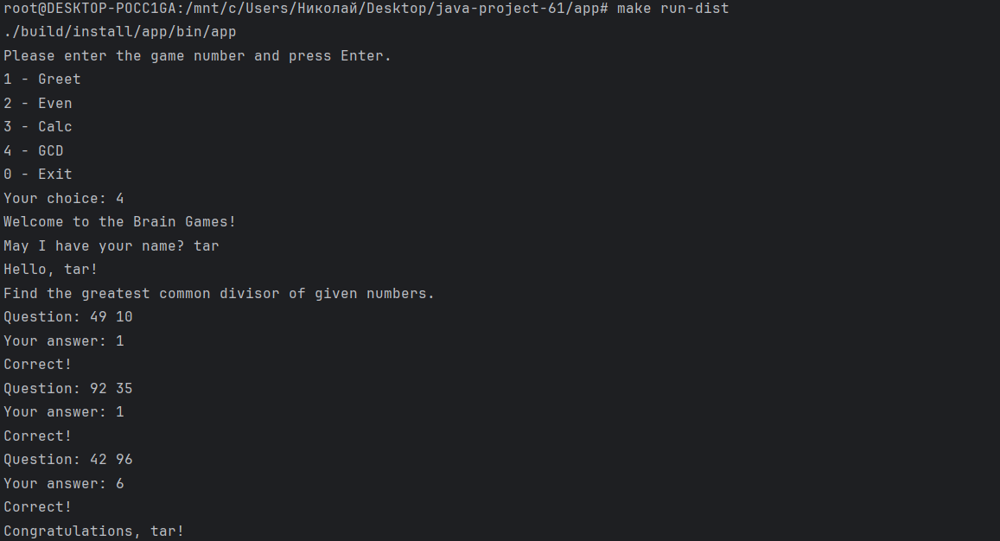
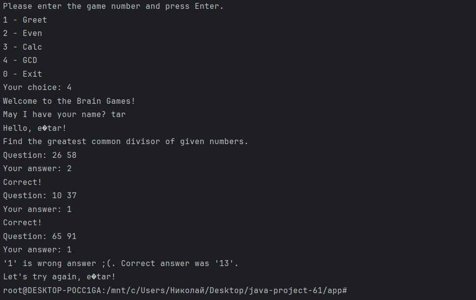

### Hexlet tests and linter status:

## 🎮 Примеры запуска игр

### Меню выбора игры

### Игра "Проверка на чётность" - Победа

### Игра "Проверка на чётность" - Поражение

### Игра "Калькулятор" - Победа

### Игра "Калькулятор" - Поражение

### Игра "НОД" - Победа

### Игра "НОД" - Поражение

